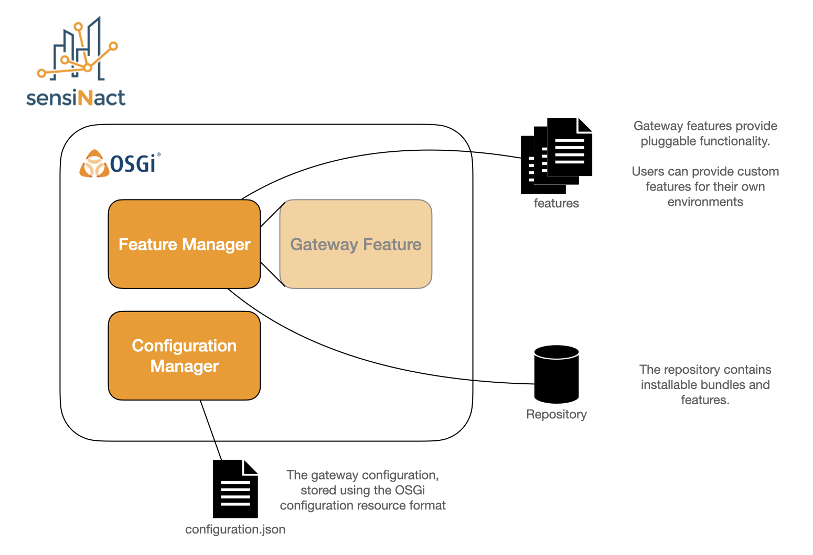

# The Eclipse sensiNact gateway distribution

The Eclipse sensiNact gateway is distributed as a single archive produced by the `distribution/assembly` project. This archive contains the following:

* The [Eclipse sensiNact Launcher](Launcher.md), responsible for configuring and deploying the gateway components
* Feature definitions from the `features` projects.
* A single merged maven repository containing bundles and features able to be deployed into the gateway
* Launch scripts for the gateway
* A basic gateway configuration file. See [here](Launcher.md#the-configuration-file) for more information on configuring the gateway

## Launching the gateway

To launch the gateway simply follow these three steps:

1. Build or download a copy of the gateway zip archive produced by the `distribution/assembly` project.
2. Extract this archive to the location from which you wish to run the gateway.
3. Run the start.sh script

A more detailed guide is available in the [worked examples](../examples/Download.md).

## The gateway architecture

The gateway architecture is modular, and uses [OSGi](https://www.osgi.org)® as a platform. The gateway includes a launcher based upon the Feature service, which can deploy groups of bundles as a single unit.

At a high level the structure of the launcher looks like this:

{width=800px}

### Gateway features

The Eclipse sensiNact gateway makes use of OSGi® [features](https://docs.osgi.org/specification/osgi.cmpn/8.0.0/service.feature.html) for deployment. A feature is a simple way to provide a list of bundles and configurations to deploy into the gateway. Features can be in one of two places:

* The `features` folder, where each file is named `<feature artifact name>.json`
* The `repository` where each feature file is stored according to the [Maven repository layout](https://maven.apache.org/repository/layout.html).

The bundles referenced in a feature descriptor will be installed into the gateway from the `repository`.

The gateway distribution comes with a number of pre-built features, such as the `core-feature`. Users may add their own features to extend the gateway, either by putting them in the `features` folder, or by adding them to the `repository`. Any additional bundles installed by user features will also need to be available in the `repository`.

For more information about features see [here](Launcher.md#the-eclipse-sensinact-gateway-feature-manager).

### Gateway configuration

The gateway configuration is provided in a JSON file using the OSGi Configuration Resource Format. This file is read and processed by the Configuration Manager component which maps the supplied configurations into Configuration Admin. The file is "live" and any changes made to it will be automatically applied to the running gateway.

For more information about using the configuration file see [here](Launcher.md#the-configuration-file).

## Included OSGi® specifications

The gateway launcher includes implementations of the following OSGi specifications for use by all features

* [Declarative Services](https://docs.osgi.org/specification/osgi.cmpn/8.0.0/service.component.html)
* [Configuration Admin](https://docs.osgi.org/specification/osgi.cmpn/8.0.0/service.cm.html)
* [Feature Service](https://docs.osgi.org/specification/osgi.cmpn/8.0.0/service.feature.html)
* [Promises](https://docs.osgi.org/specification/osgi.cmpn/8.0.0/util.promise.html)

The `core-feature` provides the core of the sensiNact gateway, and is normally the first feature deployed. This adds the following OSGi specifications

* [Typed Events](https://docs.osgi.org/specification/osgi.cmpn/8.0.0/service.typedevent.html)
* [Push Streams](https://docs.osgi.org/specification/osgi.cmpn/8.0.0/util.pushstream.html)

Other features can be used to add additional support, such as for the Servlet Whiteboard or the Jakarta RESTful Web Services Whiteboard.
